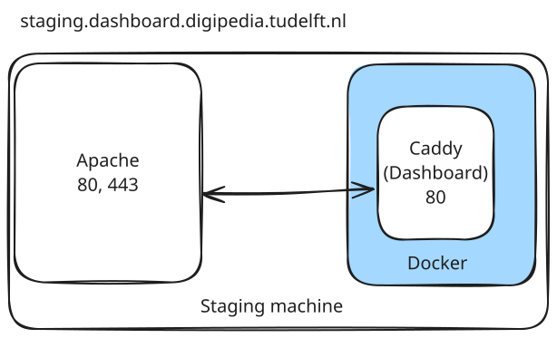

# React + TypeScript + Vite

This template provides a minimal setup to get React working in Vite with HMR and some ESLint rules.

Currently, two official plugins are available:

- [@vitejs/plugin-react](https://github.com/vitejs/vite-plugin-react/blob/main/packages/plugin-react/README.md) uses [Babel](https://babeljs.io/) for Fast Refresh
- [@vitejs/plugin-react-swc](https://github.com/vitejs/vite-plugin-react-swc) uses [SWC](https://swc.rs/) for Fast Refresh

## Expanding the ESLint configuration

If you are developing a production application, we recommend updating the configuration to enable type aware lint rules:

- Configure the top-level `parserOptions` property like this:

```js
export default {
  // other rules...
  parserOptions: {
    ecmaVersion: 'latest',
    sourceType: 'module',
    project: ['./tsconfig.json', './tsconfig.node.json'],
    tsconfigRootDir: __dirname,
  },
}
```

- Replace `plugin:@typescript-eslint/recommended` to `plugin:@typescript-eslint/recommended-type-checked` or `plugin:@typescript-eslint/strict-type-checked`
- Optionally add `plugin:@typescript-eslint/stylistic-type-checked`
- Install [eslint-plugin-react](https://github.com/jsx-eslint/eslint-plugin-react) and add `plugin:react/recommended` & `plugin:react/jsx-runtime` to the `extends` list

## Current Architecture

The stack is composed as follows:


- Apache handles inbound traffic, acting as a reverse proxy
  - HTTP requests are forwarded to 443
  - HTTPS request are TLS terminated and forwarded to NGINX
  - certificates are locally installed
- Caddy listens on its internal 80 port, serving the app
### Configuration

- Apache is consuming the `/etc/apache2/sites-available/reverse-proxy.conf` file on the machine.
- Caddy configuration is under `./deploy/Caddyfile`

## Deploy and CI/CD

### Target machine setup

> Note: this has to be done only once

To add a new target machine/enviroment there're some steps to follow in order to get a seamless configuration.

Be sure to not run the agent under `root`, it would be wiser to choose or create a dedicated user for it. This user will need to create and manage containers with Docker. Following instructions take the current logged user as candidate but you can use another user as well.

#### 1. Docker
Install Docker as stated in the official guide for the machine's OS.

Once it is installed, add the current user to the `docker` group with

```
sudo usermod -aG docker $USER
```

And verify that you can run a container without sudo with `docker run hello-world`.

> Note: you mat have to logoff and login again to get the new permission.


### 2. Install the GitHub runner on the target machine

1. To add a new self-hosted GitHub runner open the **Settings** page of the repository and follow the instructions available on (Sidebar) Actions > Runners > "New self-hosted runner".
  - after launching `./run.sh` and verified that everything is ok, kill the process with CTRL+C.
  - install the runner as a service executing `./svc.sh install $USER`, then start it with `./svc.sh start`
  - if everything went ok you should see the new runner in the repo settings.
  - add a tag to identify the runner. This tag will be used by the deployment action to pick the right machine.
2. if needed, head over the **Environment** section (sidebar) and create a new environment.
  - in the page, be sure to have set:
    - `RUNNER_NAME`: the env name (e.g. `staging`)
    - `VITE_WP_ADMIN_URL_DEV`: WP Admin page URL (e.g. `https://dev.digipedia.tudelft.nl/wp/wp-admin/`)
    - `VITE_HOMEPAGE_URL_DEV`: Platform homepage ULR (e.g. `https://dev.digipedia.tudelft.nl/`)
    - `VITE_BASE_BACKEND_URL`: Backend URL (e.g. `https://dev.digipedia.tudelft.nl/wp-json/tutorial-platform/v1`)

### 3. Install and configure Apache
1. install the `apache2` package
2. enable the required modules: `sudo a2enmod proxy proxy_http proxy_balancer lbmethod_byrequests ssl rewrite headers`
3. write the config file `/etc/apache2/sites-available/reverse-proxy.conf`, using the template provided in `./apache/reverse-proxy.conf`. Remember to fix the placeholders with your values.
4. enable and start apache with `sudo systemctl enable apache2` and `sudo systemctl start apache2`
5. check the service status with `sudo systemctl status apache2` to spot any errors
6. enable the site with `sudo a2ensite reverse-proxy.conf`

### CI/CD flow

For each push/merge to one of the target branches, CI/CD is triggered. The flow is composed by two steps:

### 1. Docker image build

The image build is pretty simple and is in two steps:
1. produces a production build with `npm run build`
2. build a Caddy container that serves the webapp.
3. call the right deploy action, selecting the environment based on current branch.

Refer to the GitHub action in [.github/workflows/docker.yml]() or, if you want to test things locally, follow (and execute) [./deploy/build.sh]().

The image is tagged with the commit SHA.

### 2. Deploying on target machine

The deploy workflow is defined in [.github/workflows/deploy.yml](), and runs on the target machine. It is possible to deploy an old version (rollback) running manually the workflow, selecting the wanted tag.
